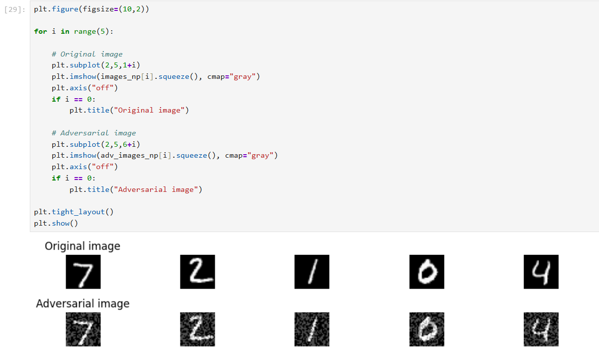
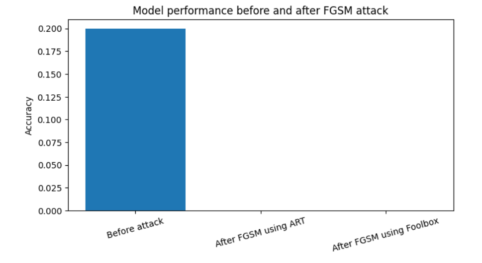

# Adversarial Attacks: IBM ART vs Foolbox
Comparative evaluation of IBM Adversarial Robustness Toolbox (ART) and Foolbox for adversarial robustness assessment of machine learning models.
This project was developed as part of a diploma thesis and investigates adversarial attacks on image classification models using the IBM ART and Foolbox frameworks on the MNIST dataset. The repository contains source code and experimental results; the full thesis document is not included.
## Project Overview
This project investigates the robustness of image classification models against adversarial attacks through a comparative analysis of two adversarial machine learning frameworks:

- IBM Adversarial Robustness Toolbox (ART)
- Foolbox

The experiments focus on evaluating adversarial attacks using the MNIST dataset and analyze how different frameworks can be applied for testing model robustness.

---

## Objectives

- Compare IBM Adversarial Robustness Toolbox (ART) and Foolbox for adversarial robustness testing
- Implement and evaluate FGSM adversarial attacks on image classification models
- Measure the impact of adversarial examples on model accuracy
- Analyze differences between frameworks in terms of usability, configuration, and effectiveness
- Evaluate the suitability of both tools for adversarial machine learning experiments

---

## Technologies

- Python
- PyTorch
- IBM Adversarial Robustness Toolbox (ART)
- Foolbox
- NumPy
- Pandas
- Matplotlib
- Jupyter Notebook

---

## Dataset
The experiments were conducted using the MNIST handwritten digits dataset.

- Dataset: MNIST
- Task: Image classification
- Number of classes: 10
- Image size: 28x28 pixels

---

## Installation
The project was developed using Python 3.10.

Required libraries:

- PyTorch
- torchvision
- IBM Adversarial Robustness Toolbox (ART)
- Foolbox
- NumPy
- Pandas
- Matplotlib
- Jupyter Notebook

Install dependencies using:

```bash
pip install -r code/requirements.txt
```

---

## Usage
The experiments were developed and tested using Jupyter Notebook.

Scripts can also be executed directly:

Run IBM ART FGSM attack:

```bash
python code/art/fgsm_art.py
```

Run Foolbox FGSM attack:

```bash
python code/foolbox/fgsm_foolbox.py
```

---

## Results

Experimental results, including FGSM adversarial examples, accuracy comparison, and result tables generated during experiments, are available in the results/ directory.
The repository contains the implementation developed as part of the diploma thesis. The full thesis document is not included in this repository.

---

## Example Results

Visualization of generated adversarial examples after applying the FGSM attack:



Accuracy comparison before and after applying FGSM attack using IBM ART and Foolbox:



---

## Limitations

The experiments included selected adversarial attack scenarios, with the main implementation focusing on FGSM attacks using the MNIST dataset.

The repository presents an implementation and comparison of IBM Adversarial Robustness Toolbox (ART) and Foolbox for adversarial robustness evaluation.

The experiments are limited to selected attack scenarios and a single image classification dataset. The results should be interpreted within the scope of the implemented test environment.

---

## Repository Structure

```text
.
├── code/
│   ├── art/
│   │   └── fgsm_art.py
│   ├── foolbox/
│   │   └── fgsm_foolbox.py
│   └── requirements.txt
├── results/
│   ├── README.md
│   ├── figures/
│   │   ├── fgsm_examples.png
│   │   └── accuracy_comparison.png
│   └── tables/
│       └── fgsm_results.md
├── thesis/
│   └── README.md
│   
├── README.md
├── LICENSE
└── .gitignore

